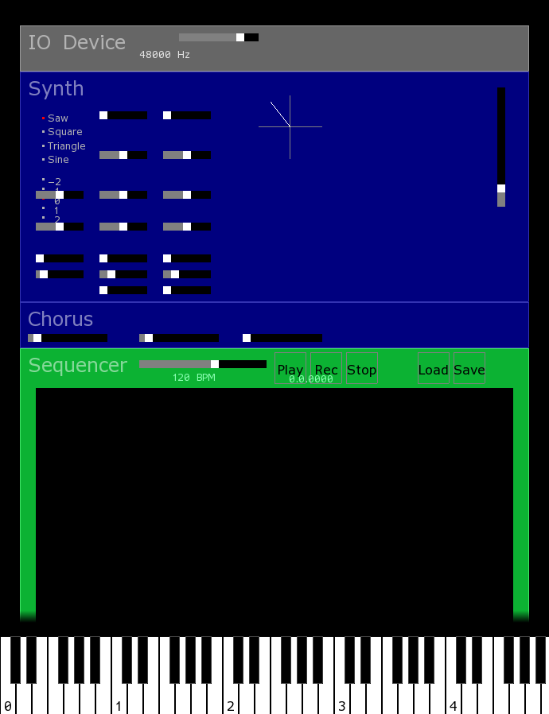

# audiostudio

An exploration of writing a self contained software virtual music studio. Uses JACK for sound and MIDI and OpenGL for GUI.



## Building

Building requires a C compiler and make and libraries.

In Alpine Linux:
```
sudo apk add freetype-dev glfw-dev jack-dev
```

In Ubuntu:
```
sudo apt install libfreetype-dev libglfw3-dev libjack-dev
```

Run
```
make
```

## Running

Running the application requires that JACK server is running.

```
./audiostudio
```

